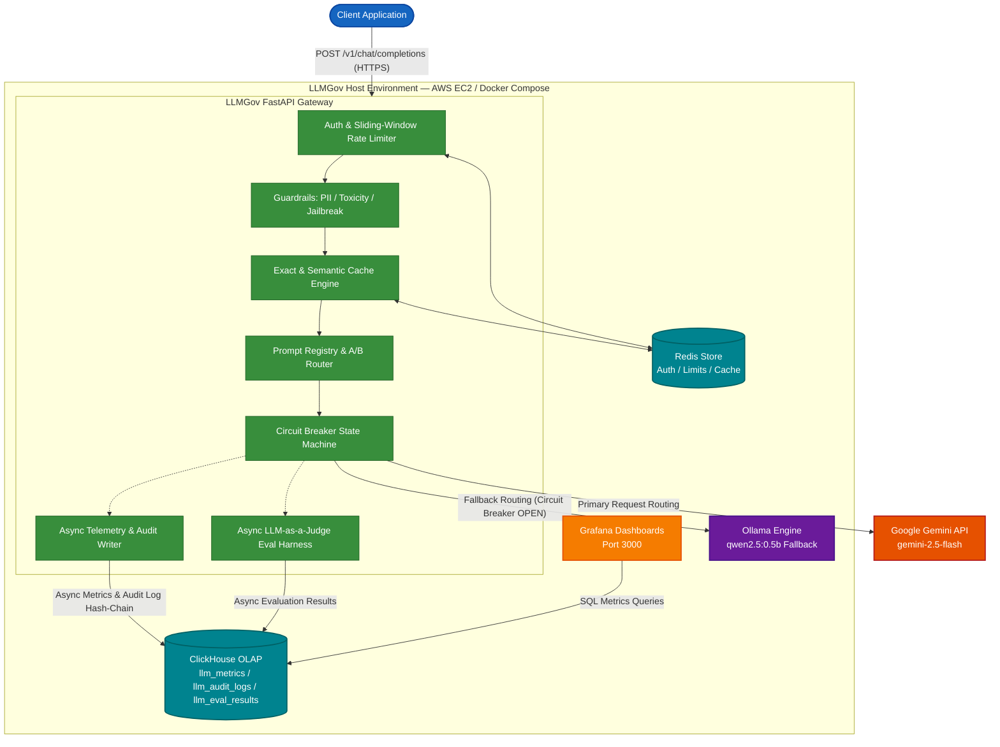

# LLMGov

A production-grade LLM gateway that unifies routing, semantic caching, safety guardrails, cost/latency telemetry, and automated evaluation across multiple providers, with sub-second failover and a tamper-evident audit trail.

> **Note**: The above describes the target architecture. Current build status is outlined in the "Current Status" section below.


## Project Resources

*   **Known Gaps & Active Checklist**: See [task.md](task.md) in the repository root.
*   **Architecture Decision Records (ADRs)**: Detailed rationales and designs are documented under [docs/adr/](docs/adr/).

## What This Is

LLMGov provides a centralized control plane for enterprise LLM consumption. Rather than having disparate services manage their own provider API keys, retries, and usage tracking, applications route requests through this gateway. This allows organizations to enforce compliance, audit all LLM interactions, and track costs and latency systematically without modifying downstream client code.

## Architecture



### C4 Level 2 Container Architecture Narrative

The **LLMGov** system is structured as a collection of isolated, containerized services orchestrated via Docker Compose on an AWS EC2 instance (`t3.large`). It operates as a governance proxy between upstream client applications and LLM backends.

#### Container Boundaries & Responsibilities

1. **Client Application (`client`):**
   - **Role:** Upstream consumer applications interacting via standard OpenAI-compatible REST endpoints (`/v1/chat/completions`).
   - **Protocol:** HTTP over TCP (Port 8000).

2. **LLMGov Gateway (`app`):**
   - **Role:** Asynchronous Python / FastAPI gateway container executing the core governance pipeline.
   - **Responsibilities:**
     - Ingests requests and assigns unique `trace_id` correlation IDs.
     - Validates bearer API keys and enforces sliding-window rate limits against **Redis**.
     - Evaluates input guardrails (PII redaction, toxicity filtering, jailbreak detection).
     - Checks the exact SHA-256 semantic cache in **Redis**.
     - Formats versioned prompt templates via the Prompt Registry (`prompts.yaml`).
     - Dispatches primary completion requests to the **Google Gemini API** via LiteLLM abstraction.
     - Monitors provider health via an integrated Circuit Breaker; automatically reroutes requests to **Ollama** if Gemini fails or trips the circuit breaker.
     - Asynchronously writes operational telemetry to **ClickHouse**.

3. **Redis Store (`redis`):**
   - **Role:** High-speed in-memory database (v7.4).
   - **Responsibilities:** Maintains API key sliding-window rate limit counters, stores exact SHA-256 request payload caches with TTL expiration, and holds reference embedding vectors.

4. **ClickHouse OLAP (`clickhouse`):**
   - **Role:** Columnar analytical database (v24.8).
   - **Responsibilities:** Persists high-volume, append-only operational telemetry into `default.llm_metrics` and compliance audit trails into `default.llm_audit_logs`. Supports low-latency analytical aggregations over millions of records.

5. **Ollama Local Engine (`ollama`):**
   - **Role:** Containerized local LLM inference engine running `qwen2.5:0.5b`.
   - **Responsibilities:** Serves as a zero-cost, localized emergency fallback backend when primary cloud providers encounter outages or trip circuit breakers.

6. **Grafana Dashboards (`grafana`):**
   - **Role:** Auto-provisioned visualization server (v11) listening on Port 3000.
   - **Responsibilities:** Connects directly to ClickHouse via SQL interface to render real-time telemetry panels, tracking p50/p95/p99 latencies, token spend by application ID, and error rates.

7. **Google Gemini API (`gemini`):**
   - **Role:** External cloud LLM provider (`gemini/gemini-2.5-flash`).
   - **Responsibilities:** Serves primary chat completion requests dispatched by the gateway over HTTPS.

---


## Tech Stack

| Technology | Reason |
| :--- | :--- |
|  **Python / FastAPI** | High-performance asynchronous processing; native integration with Pydantic for strict request/response validation. |
|  **Docker Compose** | Ensures reproducible environments across dev and prod, isolating dependencies and standardizing deployments. |
|  **Terraform** | Infrastructure as Code (IaC) provisioning AWS EC2 `t3.large` instance, VPC Security Groups (restricting SSH to deployer IP), and RSA deployment key pairs. |
|  **AWS EC2** | Live cloud host environment (`ap-south-1`), running the full multi-container docker-compose stack. |
|  **Redis** | Low-latency backing store for semantic caching with automated TTL versioning, powered by a live connection pool initialized at application startup, API key authentication, and rate limiting counters. |
|  **ClickHouse** | Columnar database designed for massive OLAP workloads; handles high-throughput telemetry writes without blocking the hot path. |
|  **Grafana** | Auto-provisioned dashboards on port 3000 connected to ClickHouse for team spend attribution and p50/p95/p99 provider latency analysis. |
|  **Pydantic** | Provides robust, type-safe data validation and serialization for API contracts, ensuring strict compliance with expected schemas. |
|  **Gemini (LiteLLM)** | Utilized via LiteLLM for both completions (Gemini 2.5 Flash) and embeddings (Gemini embedding-001) as part of the primary provider integration, validating multi-modal capabilities and embedding scope policies. |
|  **Ollama (qwen2.5:0.5b)** | Local fallback provider used to prove routing and circuit breaker mechanisms work under strict 4GB VRAM constraints, prioritizing architectural validation over model intelligence. |

## Current Status

*Note: The project status tracks which core gateway pillars are fully Live versus Planned for upcoming milestones.*

| Feature | Status | Description |
| :--- | :--- | :--- |
| **Core Infrastructure** | Live | Dockerized environment (Redis, ClickHouse, FastAPI skeleton), `uvicorn` runner. |
| **Cloud Deployment** | Live | Automated Terraform IaC deployment on AWS EC2 (`ap-south-1`), exposing Gateway (`8000`) and Grafana (`3000`). |
| **Observability (Core)** | Live | Structured JSON logging, `X-Request-ID` correlation (`trace_id`), global error handling. |
| **Completions API** | Live | Single-provider proxy (`POST /v1/chat/completions`) using Gemini 2.5 Flash via LiteLLM. |
| **Telemetry (Write-Path)** | Live | Asynchronous writes to ClickHouse `llm_metrics` table upon successful completions. |
| **Semantic Caching** | Live | Exact-match caching is Live: cache key uses a SHA-256 hash of the full normalized message history (all roles, all turns) to guarantee context safety, and embedding generation uses only the latest user message. True cosine-similarity threshold scan against stored vectors remains Planned. |
| **Local Fallback (Ollama)** | Live | Directly wired into the request path via the circuit breaker state machine (`qwen2.5:0.5b`). |
| **Circuit Breaker** | Live | Full state machine verified (CLOSED -> OPEN -> HALF_OPEN -> CLOSED), including immediate low-latency Ollama fallback and a robust HALF_OPEN concurrent-probe limit (ensuring only a single probe is in-flight via a non-blocking asyncio race condition check). |
| **Safety Guardrails** | Live | PII redaction (email, phone, Luhn credit card, SSN, IPv4), output toxicity classification (weighted lexicon with meta-discussion filters), and input jailbreak detection (cosine similarity against reference embeddings) are Live on cache-miss paths. |
| **Auth & Rate Limiting** | Live | Fail-closed API key verification (returns 401 on invalid/missing key, 503 on service unavailability) and sliding-window rate limits per application (returns 429 when limits are exceeded, fails open and degrades gracefully on Redis failure), with real `app_id` routed to telemetry. |
| **Prompt Registry** | Live | Versioned YAML prompt templates (`prompts.yaml`) with weighted A/B traffic selection and template variable substitution. |
| **Grafana Dashboards** | Live | Auto-provisioned Grafana instance on port 3000 reading ClickHouse `llm_metrics` with team spend and provider latency p50/p95/p99 panels. |

## Quickstart

1. **Clone the repository:**
   ```bash
   git clone https://github.com/LeviAckermanZ9/LLMGov.git
   cd LLMGov
   ```

2. **Configure Environment Variables:**
   Copy the example environment file and configure the required keys.
   ```bash
   cp .env.example .env
   ```
   Edit `.env` and set:
   *   `GEMINI_API_KEY`: Your Google Gemini API key.
   *   `CLICKHOUSE_PASSWORD`: The password for the ClickHouse `default` user (e.g., `llmgov_dev`).

3. **Start the Stack:**
   Bring up the infrastructure and the gateway using Docker Compose.
   ```bash
   docker compose up -d
   ```

4. **Seed a Test API Key:**
   Because API Key Authentication is active and fail-closed, seed a valid API key in Redis to authenticate requests (`llmgov_sk_dev_app` mapping to `dev_app`):
   ```bash
   docker compose exec redis redis-cli hset llmgov:auth:5329527556114a7930fefa95d192ba0bdf4097fae6191ae468fae0c8b9c73de8 app_id "dev_app"
   ```

5. **Verify Health:**
   Ensure the gateway is running and responding.
   ```bash
   curl http://127.0.0.1:8000/health
   ```
   Expected response: `{"status":"healthy","service":"llmgov-gateway","version":"0.1.0","timestamp":"2026-07-05T16:47:18.532641+00:00"}`

## Live Instance

A live, cloud-deployed instance of the full LLMGov stack is running on AWS EC2 (`ap-south-1`):

* **Gateway API Base URL:** `http://13.207.27.191:8000`
* **Health Check:** `http://13.207.27.191:8000/health`
* **Completions Endpoint:** `POST http://13.207.27.191:8000/v1/chat/completions`
* **Grafana Dashboards:** `http://13.207.27.191:3000` (Credentials: `admin` / `llmgov_dev`)

### Known Limitations (Deployment)
* **HTTP / TLS:** The current live deployment operates on plain HTTP (port 8000 and port 3000) without TLS/HTTPS termination or a custom domain. Custom SSL/TLS certificates and ingress proxying are out of scope for Phase 1.
* **Grafana Credentials:** Uses auto-provisioned development credentials (`admin` / `llmgov_dev`).
* **Post-Deploy Ollama Model Warmup:** Pulling Ollama fallback models (`qwen2.5:0.5b`) is executed as an explicit post-deployment step rather than baked into container image layers.

## API Example

Here is a real request and response using the `POST /v1/chat/completions` endpoint, demonstrating a successful proxy through the gateway. Note that a valid API key must be supplied in the `Authorization` header.

**Request:**
```bash
curl -X POST http://13.207.27.191:8000/v1/chat/completions \
  -H "Content-Type: application/json" \
  -H "Authorization: Bearer llmgov_sk_dev_app" \
  -d '{
    "model": "gemini/gemini-2.5-flash",
    "messages": [{"role": "user", "content": "Why is the sky blue? Answer in one short sentence."}],
    "stream": false
  }'
```

**Response:**
```json
{
  "id": "bTFgauvmNMip4-EP04KesA4",
  "object": "chat.completion",
  "created": 1784689005,
  "model": "gemini-2.5-flash",
  "choices": [
    {
      "index": 0,
      "message": {
        "role": "assistant",
        "content": "The sky is blue because Earth's atmosphere scatters blue light more effectively than other colors."
      },
      "finish_reason": "stop"
    }
  ],
  "usage": {
    "prompt_tokens": 13,
    "completion_tokens": 217,
    "total_tokens": 230
  },
  "trace_id": "0ed794f9-7e6c-45e8-b43b-9207a3070fc4"
}
```

### PII Redaction Example

When a request contains personally identifiable information (PII), the gateway automatically redacts the sensitive values prior to calling the LLM and the embedding generator.

**Request:**
```bash
curl -X POST http://13.207.27.191:8000/v1/chat/completions \
  -H "Content-Type: application/json" \
  -H "Authorization: Bearer llmgov_sk_dev_app" \
  -d '{
    "model": "gemini/gemini-2.5-flash",
    "messages": [{"role": "user", "content": "My email is secret-pii-miss-99@example.com. Repeat that email exactly."}],
    "stream": false
  }'
```

**Response:**
```json
{
  "id": "5bpbavK-OevSjuMP-I-saQ",
  "object": "chat.completion",
  "created": 1784396516,
  "model": "gemini-2.5-flash",
  "choices": [
    {
      "index": 0,
      "message": {
        "role": "assistant",
        "content": "[EMAIL]"
      },
      "finish_reason": "stop"
    }
  ],
  "usage": {
    "prompt_tokens": 12,
    "completion_tokens": 32,
    "total_tokens": 44
  },
  "trace_id": "b5bd2bae-5bd6-4973-a1c3-f3d233a2cf64"
}
```

**Console Log Output:**
```json
{"timestamp": "2026-07-18T17:41:58.272606+00:00", "level": "INFO", "logger": "app.api.completions", "message": "Completion returned", "trace_id": "b5bd2bae-5bd6-4973-a1c3-f3d233a2cf64", "model": "gemini-2.5-flash", "provider": "gemini", "latency_ms": 1337.9, "status_code": 200, "has_pii_redacted": true, "toxicity_score": 0.0, "is_toxic": false, "jailbreak_score": 0.124, "is_jailbreak": false}
```

## Reliability

Gateway failover is hardened by an automated state-machine chaos test that systematically triggers failures to verify circuit breaker transitions (`CLOSED` → `OPEN` → `HALF_OPEN` → `CLOSED`), ensuring requests bypass failing primary providers instantly and autonomously return once recovery timeouts elapse. Additionally, a concurrency-safe integration test validates the `HALF_OPEN` state using a real `asyncio.Event`-gated interleaving mechanism, proving that multiple parallel requests are safely throttled to a single primary probe while concurrent traffic gets seamlessly routed to Ollama.

Furthermore, the sliding-window rate limiter employs a fail-open design: if Redis encounters a connection or query error while verifying the rate limit, the error is logged loudly and the request is permitted to proceed, avoiding hard-stops on network degradation.

To enforce compliance and data privacy, safety guardrails operate on every request: PII redaction runs automatically before reaching external APIs (preventing leaks to third-party providers), non-blocking output toxicity classification evaluates generated responses against a weighted lexicon, and input jailbreak detection performs cosine-similarity matching against known attack vector embeddings.

## Project Structure

```
LLMGov/
├── app/
│   ├── api/
│   │   └── completions.py       # API routing, proxy, and guardrails wiring
│   ├── config/
│   │   └── settings.py          # Pydantic settings management
│   ├── core/
│   │   ├── auth.py              # Fail-closed API key verification
│   │   ├── cache.py             # Semantic cache read/write (Redis)
│   │   ├── cache_keys.py        # Cache key builders and TTL policy
│   │   ├── circuit_breaker.py   # Provider circuit breaker state machine
│   │   ├── embeddings.py        # Gemini embedding helper (768-dim)
│   │   ├── jailbreak.py         # Cosine-similarity jailbreak detection
│   │   ├── logging.py           # Structured JSON logger
│   │   ├── pii.py               # Regex-based PII redaction module (Luhn validated)
│   │   ├── prompt_registry.py   # Versioned A/B prompt routing registry
│   │   ├── rate_limiter.py      # Fail-open Redis rate limiter
│   │   ├── redis.py             # Redis connection pool lifecycle
│   │   ├── telemetry.py         # Async ClickHouse metric writer
│   │   └── toxicity.py          # Lexicon-based output toxicity classifier
│   ├── middleware/
│   │   ├── error_handler.py     # Global exception handlers
│   │   └── request_id.py        # Trace ID generation and correlation
│   ├── models/
│   │   └── completions.py       # Pydantic schemas for completions
│   ├── __init__.py
│   └── main.py                  # FastAPI application entrypoint
├── docker/
│   ├── clickhouse/
│   │   └── init/
│   │       ├── 001_llm_metrics.sql
│   │       ├── 002_llm_audit_logs.sql
│   │       └── 003_llm_eval_results.sql
│   └── grafana/
│       ├── dashboards/          # Auto-provisioned Grafana JSON dashboard
│       └── provisioning/        # Datasource and dashboard provider configs
├── docs/
│   ├── adr/                     # Architecture Decision Records
│   └── LLMGov_Master_Specification.docx
├── infra/
│   └── main.tf                  # Terraform IaC for AWS EC2 instance, SG rules & SSH key
├── tests/                       # 75+ automated unit and integration tests
├── .dockerignore
├── .env.example
├── .pre-commit-config.yaml
├── docker-compose.yml           # Multi-container orchestration (Redis, ClickHouse, Ollama, Grafana)
├── Dockerfile                   # Multi-stage build for the Gateway
├── prompts.yaml                 # Prompt registry configuration with version weights
├── pyproject.toml               # Python dependencies and config
└── README.md
```

---

**Author:** LeviAckermanZ9  
**Repository:** [https://github.com/LeviAckermanZ9/LLMGov](https://github.com/LeviAckermanZ9/LLMGov)  
**License:** MIT (Placeholder)
